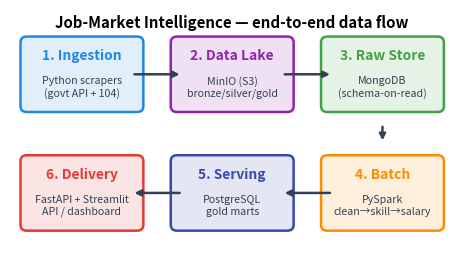

# Job-Market Intelligence Platform

> Big Data Systems — Final Project (NTU, Spring 2026)
> Turning public job-posting data into a real-time, skill-level salary & demand product for Taiwan's tech market.

A full ingestion → storage → processing → delivery pipeline built with course
"big-data" tooling. It scrapes job postings, extracts in-demand skills, normalizes
salaries, and serves skill-demand + salary benchmarks through a REST API and a
dashboard.



## What it does

- **Ingests** job postings from 台灣就業通 / Ministry of Labor **open data** (legal,
  reproducible spine) + **104.com.tw** enrichment for skill granularity.
- **Stores** raw postings in a **MinIO** data lake (bronze/silver/gold) and
  **MongoDB** (schema-on-read).
- **Processes** with a **PySpark** batch pipeline: clean → dedup → skill extraction
  (gazetteer) → salary normalization → trend aggregation.
- **Serves** gold marts from **PostgreSQL** via a **FastAPI** data feed and a
  **Streamlit** dashboard.

## Tech ↔ course concept

| Component | Tool | Course concept |
|---|---|---|
| Ingestion | Python (httpx) scrapers | data sources / acquisition |
| Data lake | MinIO (S3-compatible, `s3a://`) | distributed file system |
| Raw store | MongoDB | NoSQL store |
| Processing | PySpark (`local[*]`) | batch processing framework |
| Serving store | PostgreSQL | SQL store |
| Delivery | FastAPI + Streamlit | API / dashboard |

## Quickstart (fully offline, ~2 min after build)

Requires Docker + Docker Compose. No network needed at run time — the demo replays
committed sample data.

```bash
make demo        # build + start stack + ingest sample data + run Spark pipeline
```

Then open:

- **Dashboard**: http://localhost:8501
- **API docs**: http://localhost:8000/docs
- **MinIO console**: http://localhost:9001 (minioadmin / minioadmin)

Tear down with `make down` (keep data) or `make clean` (wipe volumes).

### Step by step (what `make demo` does)

```bash
make up             # build images + start MinIO, Mongo, Postgres, Spark, API, dashboard
make ingest-sample  # replay data/sample_data/*.json -> MinIO bronze + MongoDB (OFFLINE)
make pipeline       # PySpark: bronze -> silver -> gold marts in Postgres
make urls           # print the URLs
```

### Live data collection (optional, needs network)

```bash
make scrape         # scrape live government open data
make scrape-104     # scrape live 104.com.tw enrichment (low volume, polite)
make pipeline
```

## Example API calls

```bash
curl "localhost:8000/summary"
curl "localhost:8000/skills/trending?limit=10"
curl "localhost:8000/salary?skill=Python&region=ALL&seniority=ALL"
curl "localhost:8000/skills/Spark/trend"
```

## Reproducing the demand evidence

```bash
python data/generate_sample.py        # regenerate the deterministic sample corpus
python docs/make_figures.py           # rebuild report figures from the live API
jupyter notebook notebooks/demand_analysis.ipynb
```

## Repository layout

```
scrapers/      ingestion: base scraper, govt + 104 sources, lake writer, skills gazetteer
spark_jobs/    PySpark: common, clean, dedup, salary_norm, skill_extract, trend_aggregate, run_all
api/           FastAPI: routers (skills, salary), db, schemas
dashboard/     Streamlit app
sql/           Postgres gold-mart schema + indexes
data/          sample_data/ (committed) + generator
docs/          architecture diagram, data-ethics policy, figure generator
notebooks/     demand_analysis.ipynb
report/        r14922128.pdf
```

## Data ethics

Sources, licensing, scraping etiquette, and the PII policy are documented in
[`docs/data_ethics.md`](docs/data_ethics.md). Short version: the government feed is
openly licensed; 104 is enrichment-only under the academic exception; **no personal
data is ever stored** (the schema has no PII fields and free text is scrubbed).

## Notes on scale

The default runs Spark in `local[*]` against a single MinIO node — appropriate for
the data volume. The same code scales out by pointing `s3a://` at a multi-node
object store (or HDFS) and submitting to a Spark cluster; a Kafka topic and a
Prefect/Airflow DAG are the natural production additions (see the report).
